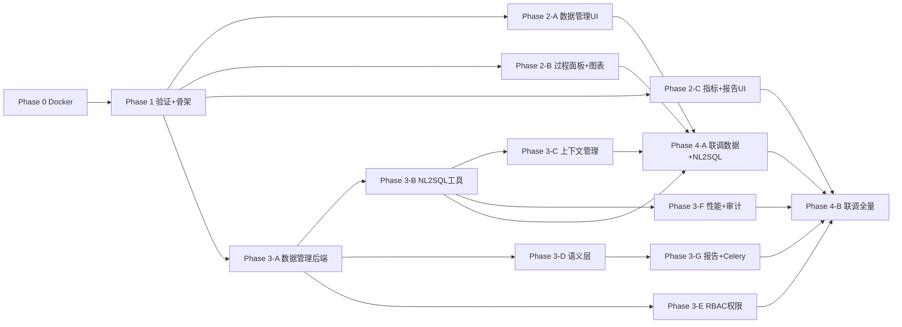
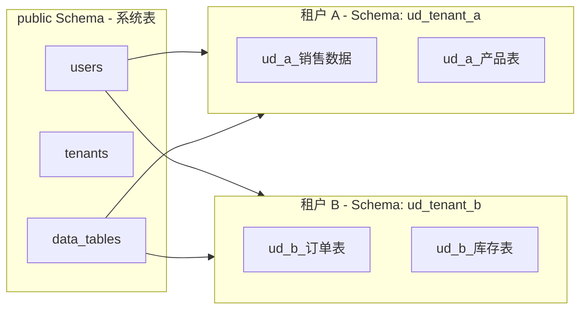
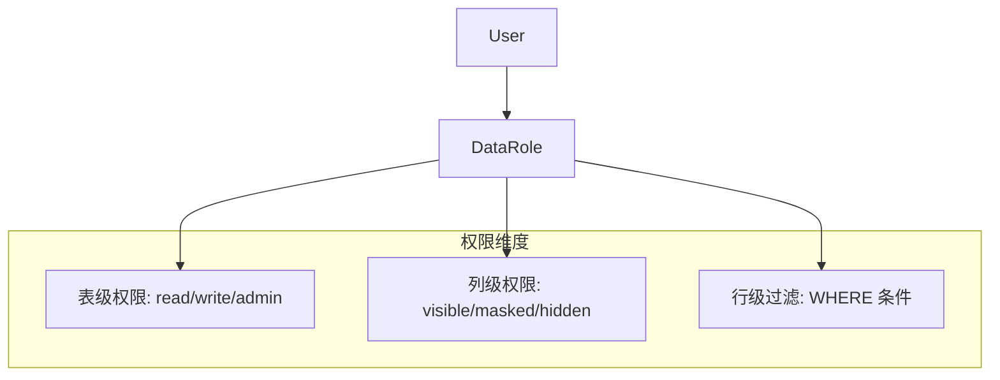

# 智能数据分析系统 — Phase 分阶段实施计划

## 总览

按 **Phase 0 → 1 → 2 → 3 → 4** 五大阶段推进，其中 Phase 2 (前端) 拆分 3 个子阶段，Phase 3 (后端) 拆分 7 个子阶段，Phase 4 (联调) 拆分 2 个子阶段。共产出 **15 个 phase 计划文件**，存放于 `docs/plans/`。

```
docs/plans/
├── phase-0-docker-update.md            # Docker + 依赖更新
├── phase-1-verify-scaffold.md          # 验证跑通 + 骨架搭建
├── phase-2a-frontend-data-page.md      # 前端: 数据管理页
├── phase-2b-frontend-process-chart.md  # 前端: 过程面板 + 图表
├── phase-2c-frontend-metric-report.md  # 前端: 指标 + 报告 + 权限
├── phase-3a-backend-data-mgmt.md       # 后端: 数据管理 + 多租户隔离
├── phase-3b-backend-nl2sql-tools.md    # 后端: NL2SQL Agent 工具集
├── phase-3c-backend-context-mgmt.md    # 后端: 上下文管理
├── phase-3d-backend-semantic-layer.md  # 后端: 语义层/指标
├── phase-3e-backend-rbac-masking.md    # 后端: RBAC 权限 + 脱敏
├── phase-3f-backend-perf-audit.md      # 后端: 性能优化 + 审计
├── phase-3g-backend-report-celery.md   # 后端: AI 报告 + 定时任务
├── phase-4a-integration-data-nl2sql.md # 联调: 数据管理 + NL2SQL
└── phase-4b-integration-full.md        # 联调: 指标+权限+审计+报告
```

### 依赖关系




## 二、新增后端模块详解

### 模块 1: 数据管理模块 (Data Management)

**职责**: 用户上传 Excel/CSV/SQLite 文件，解析入库，提供表级 CRUD 管理。

**核心设计决策**:

- 用户数据表统一命名: `ud_{user_id_short}_{upload_name}`（`ud_` 前缀 = user data）
- 用户数据全部存入 PostgreSQL，使用独立 schema `user_data` 与系统表隔离
- SQLite 文件上传后，解析所有表并导入到 PG 的 `user_data` schema 下
- 原始文件同时存储到 MinIO 作为备份

**新增文件**:

- `backend/app/api/v1/data.py` — API 路由
- `backend/app/models/data_source.py` — DataSource ORM 模型
- `backend/app/models/data_table.py` — DataTable ORM 模型
- `backend/app/core/data/manager.py` — 数据管理核心逻辑
- `backend/app/core/data/parsers.py` — Excel/CSV/SQLite 解析器
- `backend/app/schemas/data.py` — Pydantic schemas

**新增 ORM 模型**:

```python
# DataSource: 用户上传的数据源
class DataSource(Base):
    __tablename__ = "data_sources"
    id: UUID
    user_id: UUID (FK users.id)
    tenant_id: UUID (FK tenants.id, nullable)
    name: str             # 数据源显示名
    source_type: str      # "excel" | "csv" | "sqlite"
    original_filename: str
    minio_path: str       # MinIO 备份路径
    file_size: int
    table_count: int      # 包含的表数量
    status: str           # "uploading" | "processing" | "ready" | "failed"
    error_message: str?
    created_at / updated_at

# DataTable: 数据源中的单个表
class DataTable(Base):
    __tablename__ = "data_tables"
    id: UUID
    data_source_id: UUID (FK data_sources.id)
    user_id: UUID (FK users.id)
    pg_schema: str = "user_data"     # PG schema
    pg_table_name: str               # ud_{uid8}_{name}
    display_name: str                # 用户可见的表名
    description: str?
    column_schema: JSON              # [{name, type, nullable, comment}]
    row_count: int
    is_writable: bool = True
    created_at / updated_at
```

**API 端点** (`/api/v1/data`):

- `POST /upload` — 上传 Excel/CSV/SQLite 文件，异步解析入库
- `GET /sources` — 列出用户所有数据源
- `GET /sources/{id}` — 数据源详情（含所属表列表）
- `DELETE /sources/{id}` — 删除数据源及其所有表
- `GET /tables` — 列出用户所有表
- `GET /tables/{id}` — 表详情（含 schema 信息）
- `GET /tables/{id}/data` — 分页查询表数据
- `PUT /tables/{id}` — 更新表描述/显示名
- `DELETE /tables/{id}` — 删除单个表
- `GET /tables/{id}/schema` — 获取表结构（供 Agent 使用）

### 模块 2: 语义层 / 指标管理模块 (Semantic Layer / Metrics)

**职责**: 定义业务指标、维度、术语映射，供 NL2SQL Agent 引用以生成精确 SQL。

**新增文件**:

- `backend/app/api/v1/metrics.py` — API 路由
- `backend/app/models/metric.py` — Metric ORM 模型
- `backend/app/models/dimension.py` — Dimension ORM 模型
- `backend/app/models/business_term.py` — BusinessTerm ORM 模型
- `backend/app/core/semantic/layer.py` — 语义层检索服务
- `backend/app/schemas/metric.py` — Pydantic schemas

**新增 ORM 模型**:

```python
# Metric: 指标定义
class Metric(Base):
    __tablename__ = "metrics"
    id: UUID
    user_id: UUID
    tenant_id: UUID?
    name: str                  # "销售额"
    english_name: str          # "sales_amount"
    description: str           # 口径说明
    formula: str               # "SUM(orders.amount)"
    data_table_id: UUID?       # FK data_tables.id（关联的表）
    source_table: str          # 可手动指定表名
    dimensions: JSON           # ["date", "region", "category"]
    filters: JSON              # ["status = 'completed'"]
    time_granularity: JSON     # ["day", "week", "month"]
    category: str              # 指标分类
    status: str                # "active" | "draft" | "deprecated"
    version: str
    created_at / updated_at

# Dimension: 维度定义
class Dimension(Base):
    __tablename__ = "dimensions"
    id: UUID
    user_id: UUID
    name: str                  # "地区"
    english_name: str          # "region"
    description: str
    data_table_id: UUID?
    source_column: str         # 对应的列名
    hierarchy: JSON?           # 层级关系 ["国家", "省", "市"]
    created_at / updated_at

# BusinessTerm: 业务术语同义词映射
class BusinessTerm(Base):
    __tablename__ = "business_terms"
    id: UUID
    user_id: UUID
    term: str                  # "营收"
    canonical_name: str        # "sales_amount" (指向 metric.english_name)
    term_type: str             # "metric" | "dimension" | "filter"
    created_at
```

**API 端点** (`/api/v1/metrics`):

- CRUD for Metrics, Dimensions, BusinessTerms
- `GET /metrics/search?q=xxx` — 搜索指标（供 Agent 工具调用）
- `GET /metrics/{id}/lineage` — 指标血缘（后续扩展）

**向量化**: 指标名称+描述+术语映射写入 Milvus，Agent 通过语义检索找到最相关指标。

### 模块 3: NL2SQL Agent 工具集

**职责**: 将自然语言转换为 SQL 并执行，以 Agent Tool 形式注册到现有 `ToolRegistry`。

**新增文件**:

- `backend/app/core/tools/builtin/data_query.py` — SQL 查询执行工具
- `backend/app/core/tools/builtin/schema_inspect.py` — 表结构检查工具
- `backend/app/core/tools/builtin/metric_lookup.py` — 指标检索工具
- `backend/app/core/tools/builtin/chart_recommend.py` — 图表推荐工具
- `backend/app/core/tools/builtin/data_modify.py` — 数据修改工具（仅限用户表）

**工具定义**:

- `**inspect_tables**`: 列出用户可用的所有数据表及摘要
  - 入参: `{ keyword?: string }`
  - 出参: 表名列表 + 简要描述
- `**inspect_table_schema**`: 获取指定表的完整 schema
  - 入参: `{ table_name: string }`
  - 出参: 列名、类型、注释、示例数据（前3行）
- `**lookup_metrics**`: 语义检索匹配的业务指标
  - 入参: `{ query: string }`
  - 出参: 匹配的指标列表（含公式、维度、过滤条件）
- `**execute_sql**`: 执行只读 SQL 查询
  - 入参: `{ sql: string, table_name?: string }`
  - 出参: 查询结果（JSON 格式，限制 1000 行）
  - 安全: SQL 白名单检查，禁止 DDL/DML（用户表除外）、强制 LIMIT
- `**modify_user_data**`: 对用户自建表执行写操作
  - 入参: `{ sql: string, table_name: string }`
  - 出参: 影响行数 + 变更预览
  - 安全: 仅允许 `user_data` schema 下的表，单次限制 1000 行
- `**recommend_chart**`: 根据查询结果推荐可视化图表类型
  - 入参: `{ columns: list, sample_data: list, query_intent?: string }`
  - 出参: 推荐图表类型 + 配置（x轴/y轴/颜色映射等）

**注册方式**: 在 `backend/app/main.py` 启动时，将上述工具通过 `ToolRegistry.register_builtin()` 注册，复用现有 Agent tool-calling 流程。

**System Prompt 增强**: 修改 [chat.py](backend/app/api/v1/chat.py) 中的 `DEFAULT_SYSTEM_PROMPT`，增加数据分析角色说明：

```python
DEFAULT_SYSTEM_PROMPT = """你是 KK 智能数据分析助手。你可以:
1. 查询用户上传的数据表 (使用 inspect_tables/inspect_table_schema)
2. 根据业务指标生成精确的 SQL (使用 lookup_metrics)
3. 执行 SQL 查询并返回结果 (使用 execute_sql)
4. 推荐合适的可视化图表 (使用 recommend_chart)
5. 对用户自建表进行数据修改 (使用 modify_user_data)

工作流程:
- 先理解用户意图
- 检查可用的表和指标
- 生成并执行 SQL
- 返回结果并推荐可视化
"""
```

### 模块 4: AI 报告模块 (Report)

**职责**: AI 驱动的报告生成 + 定时调度。

**新增文件**:

- `backend/app/api/v1/reports.py` — API 路由
- `backend/app/models/report.py` — Report ORM
- `backend/app/models/report_template.py` — ReportTemplate ORM
- `backend/app/models/report_schedule.py` — ReportSchedule ORM
- `backend/app/core/report/generator.py` — 报告生成引擎（调用 LLM）
- `backend/app/core/report/scheduler.py` — 定时任务管理
- `backend/app/schemas/report.py` — Pydantic schemas
- `backend/app/tasks/report_tasks.py` — Celery 异步任务

**新增 ORM 模型**:

```python
class Report(Base):
    __tablename__ = "reports"
    id: UUID
    user_id: UUID
    tenant_id: UUID?
    title: str
    content: TEXT             # Markdown 格式的报告内容
    report_type: str          # "manual" | "scheduled"
    template_id: UUID?
    data_config: JSON         # 关联的表/指标/查询配置
    charts: JSON              # 报告内嵌图表配置
    minio_path: str?          # 导出的 PDF/HTML 路径
    status: str               # "draft" | "generating" | "ready" | "failed"
    schedule_id: UUID?
    created_at / updated_at

class ReportTemplate(Base):
    __tablename__ = "report_templates"
    id: UUID
    user_id: UUID?            # null = 系统模板
    name: str
    description: str
    template_content: TEXT    # Markdown 模板（含占位符）
    data_config: JSON         # 需要的数据查询配置
    category: str
    is_system: bool = False
    created_at / updated_at

class ReportSchedule(Base):
    __tablename__ = "report_schedules"
    id: UUID
    user_id: UUID
    report_template_id: UUID?
    name: str
    cron_expression: str      # "0 9 * * *" (每天9点)
    data_config: JSON
    is_active: bool = True
    last_run_at: datetime?
    next_run_at: datetime?
    created_at / updated_at
```

**定时任务**: 使用 Celery + Redis（项目已有 Redis），通过 `celery beat` 调度器触发。Celery Worker 作为新的 Docker 服务加入 `docker-compose.yml`。

### 模块 5: 上下文管理模块 (Context Manager)

**职责**: Token 计算、上下文累积追踪、达到 60% 阈值时自动摘要压缩。

**新增文件**:

- `backend/app/core/context/manager.py` — 上下文管理核心
- `backend/app/core/context/token_counter.py` — Token 计算器
- `backend/app/core/context/summarizer.py` — 上下文摘要器

**核心逻辑**:

```python
class ContextManager:
    MAX_TOKENS = {
        "deepseek-chat": 64000,
        "deepseek-reasoner": 64000,
        "qwen-plus": 128000,
    }
    COMPRESS_THRESHOLD = 0.6  # 60% 触发压缩

    def build_messages(self, conversation, user_input, ...) -> list[dict]:
        """构建消息列表，自动进行上下文管理"""
        messages = self._collect_messages(conversation, user_input, ...)
        total_tokens = self.count_tokens(messages)
        max_tokens = self.MAX_TOKENS.get(model, 64000)

        if total_tokens > max_tokens * self.COMPRESS_THRESHOLD:
            messages = await self.compress(messages, max_tokens)

        return messages

    async def compress(self, messages, max_tokens):
        """保留 system + 最近 N 轮 + 摘要旧消息"""
        # 1. 保留 system prompt
        # 2. 将旧消息通过 LLM 总结为一条摘要
        # 3. 保留最近 4-6 轮对话原文
        # 4. 确保总 token 低于阈值
```

**Token 计算**: 使用 `tiktoken`（OpenAI 兼容编码），对 DeepSeek/Qwen 采用近似计算。

**集成点**: 替换 [chat.py](backend/app/api/v1/chat.py) 中的 `_build_messages` 函数，改用 `ContextManager.build_messages()`。

### 模块 6: 新增 Agent 工具注册

在 `backend/app/core/tools/builtin/` 目录下新增以上所有工具文件，并在 [main.py](backend/app/main.py) 的 `lifespan` 中统一注册：

```python
# 注册数据分析相关内置工具
from app.core.tools.builtin.schema_inspect import register as register_schema_tools
from app.core.tools.builtin.data_query import register as register_query_tools
from app.core.tools.builtin.metric_lookup import register as register_metric_tools
from app.core.tools.builtin.chart_recommend import register as register_chart_tools
from app.core.tools.builtin.data_modify import register as register_modify_tools

register_schema_tools(tool_registry)
register_query_tools(tool_registry)
register_metric_tools(tool_registry)
register_chart_tools(tool_registry)
register_modify_tools(tool_registry)
```

---

## 三、新增前端模块详解

### 模块 A: 过程展示面板 (Process Panel)

**位置**: Chat 页面右侧可折叠面板，展示 Agent 执行过程。

**修改文件**:

- [frontend/src/pages/ChatPage.tsx](frontend/src/pages/ChatPage.tsx) — 增加右侧面板布局
- 新增 `frontend/src/components/chat/ProcessPanel.tsx` — 过程面板主组件
- 新增 `frontend/src/components/chat/ProcessStepItem.tsx` — 单个步骤展示
- 修改 [frontend/src/stores/chatStore.ts](frontend/src/stores/chatStore.ts) — 增加过程数据状态

**展示内容** (基于现有 SSE 事件扩展):

- LLM 思考过程 (reasoning)
- 工具调用详情 (tool_call → tool_result)
- SQL 语句 + 执行结果预览
- RAG 检索来源
- 图表推荐结果

**布局变更**:

```
ChatPage.tsx 从:
┌──────────────────────────────┐
│         MessageList          │
│         ChatInput            │
└──────────────────────────────┘

变为:
┌───────────────────┬──────────┐
│    MessageList    │ Process  │
│    ChatInput      │ Panel    │
└───────────────────┴──────────┘
```

### 模块 B: 图表渲染组件 (Chart Renderer)

**新增文件**:

- `frontend/src/components/chart/ChartRenderer.tsx` — 统一图表渲染入口
- `frontend/src/components/chart/ChartTypeSelector.tsx` — 图表类型切换
- `frontend/src/components/chart/DataTable.tsx` — 数据表格展示

**技术选择**: 使用项目已有的 Recharts 库。

**集成方式**: 在 `MessageItem` 中，当 assistant 消息包含图表推荐结果时，渲染 `ChartRenderer` 组件。Agent 的 `recommend_chart` 工具返回的 JSON 配置直接驱动 Recharts 渲染。

### 模块 C: 数据管理页面 (DataPage)

**新增文件**:

- `frontend/src/pages/DataPage.tsx` — 数据管理页面
- `frontend/src/components/data/FileUpload.tsx` — 文件上传组件
- `frontend/src/components/data/DataSourceList.tsx` — 数据源列表
- `frontend/src/components/data/TableDetail.tsx` — 表详情/数据预览
- `frontend/src/stores/dataStore.ts` — 数据管理状态

**路由**: 在 [App.tsx](frontend/src/App.tsx) 中添加 `/data` 路由。

### 模块 D: 指标管理页面 (MetricPage)

**新增文件**:

- `frontend/src/pages/MetricPage.tsx`
- `frontend/src/components/metric/MetricList.tsx`
- `frontend/src/components/metric/MetricForm.tsx`
- `frontend/src/stores/metricStore.ts`

**路由**: `/metrics`

### 模块 E: 报告中心页面 (ReportPage)

**新增文件**:

- `frontend/src/pages/ReportPage.tsx`
- `frontend/src/components/report/ReportList.tsx`
- `frontend/src/components/report/ReportEditor.tsx`
- `frontend/src/components/report/ScheduleManager.tsx`
- `frontend/src/stores/reportStore.ts`

**路由**: `/reports`

---

## 四、数据库 Schema 隔离策略

```sql
-- 系统表: 默认 public schema
public.users
public.tenants
public.conversations
public.messages
public.data_sources      -- 新增
public.data_tables        -- 新增
public.metrics            -- 新增
public.dimensions         -- 新增
public.business_terms     -- 新增
public.reports            -- 新增
public.report_templates   -- 新增
public.report_schedules   -- 新增

-- 用户数据表: user_data schema（完全隔离）
user_data.ud_a1b2c3d4_sales_orders
user_data.ud_a1b2c3d4_products
user_data.ud_e5f6g7h8_inventory
```

在 `docker/postgres/init.sql` 中添加:

```sql
CREATE SCHEMA IF NOT EXISTS user_data;
```

---

## 五、Docker 新增服务

在 [docker-compose.yml](docker-compose.yml) 中新增 Celery Worker 服务:

```yaml
celery-worker:
  build: ./backend
  command: celery -A app.tasks worker --loglevel=info
  depends_on: [postgres, redis]
  env_file: .env

celery-beat:
  build: ./backend
  command: celery -A app.tasks beat --loglevel=info
  depends_on: [redis]
  env_file: .env
```

---

## 六、SSE 事件扩展

在现有 SSE 事件类型基础上，新增以下事件供前端 Process Panel 消费:

- `type: "sql_generated"` — SQL 生成完成，data 含 SQL 文本
- `type: "sql_result"` — SQL 执行结果，data 含结果集摘要
- `type: "chart_config"` — 图表推荐配置，data 含 Recharts 兼容的 JSON
- `type: "metric_matched"` — 指标匹配结果
- `type: "context_compressed"` — 上下文被压缩的通知

> 注意: 上述事件实际由 Agent 工具调用产生，通过现有的 `tool_call` / `tool_result` SSE 事件传递即可，前端 ProcessPanel 解析 tool_result 中的结构化数据来渲染对应 UI。无需新增 SSE 事件类型，保持协议简洁。

---

## 七、企业级能力：多租户数据隔离

### 7.1 隔离架构

现有项目已有 `Tenant` 模型和 `tenant_id` 字段，在此基础上将数据隔离贯穿到用户数据表层。




**核心设计变更**:

- 用户数据表命名规则升级为: `ud_{tenant_id_short8}_{user_id_short8}_{table_name}`
- 每个租户使用独立的 PostgreSQL schema: `ud_tenant_{tenant_id_short8}`
- 无租户的个人用户使用 schema: `ud_personal_{user_id_short8}`
- SQL 执行时强制 `SET search_path` 为当前用户对应的 tenant schema，从底层杜绝跨租户访问

**DataTable 模型补充字段**:

```python
class DataTable(Base):
    __tablename__ = "data_tables"
    # ... 原有字段 ...
    tenant_id: UUID?              # FK tenants.id，租户隔离键
    pg_schema: str                # "ud_tenant_{tid8}" 或 "ud_personal_{uid8}"
    pg_table_name: str            # ud_{tid8}_{uid8}_{name}
    visibility: str = "private"   # "private" | "tenant" | "public"
    # private: 仅创建者可见
    # tenant: 同租户所有用户可见（受 RBAC 限制）
    # public: 租户内所有用户可见（仅限只读）
```

**Tenant Config 扩展** (扩展现有 `tenants.config` JSON):

```python
TENANT_DATA_CONFIG = {
    "allowed_models": [...],
    "token_quota": 0,
    "storage_quota_mb": 10240,
    "max_users": 100,
    # 新增
    "max_data_sources": 50,          # 最大数据源数量
    "max_tables": 200,               # 最大表数量
    "max_rows_per_table": 1000000,   # 单表最大行数
    "max_total_storage_mb": 5120,    # 数据总存储限制
    "allowed_file_types": ["excel", "csv", "sqlite"],
    "sql_timeout_seconds": 30,       # SQL 执行超时
    "max_query_rows": 1000,          # 单次查询返回行数
}
```

**隔离执行层** — 新增 `backend/app/core/data/isolated_executor.py`:

```python
class IsolatedSQLExecutor:
    """租户隔离的 SQL 执行器"""

    async def execute_read(self, tenant_schema: str, sql: str, user: User) -> QueryResult:
        """只读查询，强制 search_path 为租户 schema"""
        async with self._get_connection() as conn:
            await conn.execute(f"SET search_path TO {tenant_schema}, public")
            await conn.execute(f"SET statement_timeout TO '{timeout}s'")
            # 执行 SQL ...

    async def execute_write(self, tenant_schema: str, sql: str, user: User, table: DataTable) -> WriteResult:
        """写操作，额外校验表所有权"""
        # 1. 验证 table.user_id == user.id
        # 2. 验证 table.pg_schema == tenant_schema
        # 3. 开启事务 + savepoint
        # 4. 记录变更前快照（审计用）
        # 5. 执行写 SQL
        # 6. 记录审计日志
```

---

## 八、企业级能力：数据权限控制 (RBAC + 行列级权限)

### 8.1 权限模型设计




**新增文件**:

- `backend/app/models/data_permission.py` — 权限 ORM 模型
- `backend/app/core/security/data_access.py` — 数据访问控制引擎
- `backend/app/core/security/masking.py` — 字段脱敏引擎
- `backend/app/api/v1/data_permissions.py` — 权限管理 API

**新增 ORM 模型**:

```python
class DataRole(Base):
    """数据角色 — 比系统 role 更细粒度的数据访问角色"""
    __tablename__ = "data_roles"
    id: UUID
    tenant_id: UUID             # FK tenants.id
    name: str                   # "销售部数据分析师"、"财务只读"
    description: str
    is_default: bool = False    # 租户默认角色
    created_at / updated_at

class DataRoleAssignment(Base):
    """用户 ←→ 数据角色关联"""
    __tablename__ = "data_role_assignments"
    id: UUID
    user_id: UUID               # FK users.id
    data_role_id: UUID          # FK data_roles.id
    assigned_by: UUID           # 分配人
    created_at

class TablePermission(Base):
    """表级权限"""
    __tablename__ = "table_permissions"
    id: UUID
    data_role_id: UUID          # FK data_roles.id
    data_table_id: UUID         # FK data_tables.id
    permission: str             # "read" | "write" | "admin"
    created_at

class ColumnPermission(Base):
    """列级权限 — 控制字段可见性和脱敏"""
    __tablename__ = "column_permissions"
    id: UUID
    data_role_id: UUID          # FK data_roles.id
    data_table_id: UUID         # FK data_tables.id
    column_name: str
    visibility: str             # "visible" | "masked" | "hidden"
    masking_rule: str?          # "last4" | "first3" | "email_mask" | "full_mask" | null
    created_at

class RowFilter(Base):
    """行级过滤条件"""
    __tablename__ = "row_filters"
    id: UUID
    data_role_id: UUID          # FK data_roles.id
    data_table_id: UUID         # FK data_tables.id
    filter_expression: str      # SQL WHERE 子句: "department = '{user.department}'"
    description: str            # "仅查看本部门数据"
    created_at
```

### 8.2 数据访问控制引擎

`backend/app/core/security/data_access.py`:

```python
class DataAccessControl:
    """数据访问控制 — 在 SQL 执行前进行权限检查和 SQL 改写"""

    async def check_table_access(self, user: User, table: DataTable, op: str) -> bool:
        """检查用户对表的操作权限 (read/write)"""

    async def get_visible_columns(self, user: User, table: DataTable) -> list[ColumnAccess]:
        """获取用户对该表每列的可见性和脱敏规则"""
        # 返回: [{column: "phone", visibility: "masked", rule: "last4"}, ...]

    async def rewrite_sql_with_filters(self, user: User, sql: str, tables: list[DataTable]) -> str:
        """将行级过滤条件注入 SQL WHERE 子句"""
        # 示例: SELECT * FROM orders → SELECT * FROM orders WHERE department = '销售部'

    async def apply_column_masking(self, result: QueryResult, user: User, table: DataTable) -> QueryResult:
        """对查询结果应用列级脱敏"""
        # phone: 138****1234, email: z***@xxx.com, id_card: ************1234
```

### 8.3 脱敏规则引擎

`backend/app/core/security/masking.py`:

```python
MASKING_RULES = {
    "last4":      lambda v: "****" + str(v)[-4:] if v else None,       # ****1234
    "first3":     lambda v: str(v)[:3] + "****" if v else None,        # 138****
    "phone":      lambda v: str(v)[:3] + "****" + str(v)[-4:],         # 138****1234
    "email_mask": lambda v: v[0] + "***@" + v.split("@")[1] if "@" in str(v) else "***",
    "id_card":    lambda v: "**************" + str(v)[-4:],            # **************1234
    "full_mask":  lambda v: "******",                                   # ******
    "amount":     lambda v: "***.**",                                   # 金额隐藏
}
```

### 8.4 权限管理 API

`/api/v1/data-permissions`:

- `GET /roles` — 列出租户下所有数据角色
- `POST /roles` — 创建数据角色
- `PUT /roles/{id}` — 更新角色
- `DELETE /roles/{id}` — 删除角色
- `POST /roles/{id}/assign` — 给用户分配角色
- `DELETE /roles/{id}/assign/{user_id}` — 移除用户角色
- `GET /roles/{id}/permissions` — 查看角色权限详情
- `PUT /roles/{id}/table-permissions` — 设置表级权限
- `PUT /roles/{id}/column-permissions` — 设置列级权限
- `PUT /roles/{id}/row-filters` — 设置行级过滤

### 8.5 与 Agent 工具集成

所有 NL2SQL Agent 工具在执行前，自动经过 `DataAccessControl` 检查:

```python
# 在 execute_sql 工具内部
async def execute_sql_tool(arguments: dict, user: User) -> str:
    sql = arguments["sql"]
    tables = parse_tables_from_sql(sql)

    # 1. 表级权限检查
    for table in tables:
        if not await dac.check_table_access(user, table, "read"):
            return f"权限不足: 无法访问表 {table.display_name}"

    # 2. 行级过滤注入
    sql = await dac.rewrite_sql_with_filters(user, sql, tables)

    # 3. 执行查询
    result = await executor.execute_read(tenant_schema, sql, user)

    # 4. 列级脱敏
    result = await dac.apply_column_masking(result, user, tables[0])

    return result
```

---

## 九、企业级能力：查询性能优化

### 9.1 多级缓存架构


**新增文件**:

- `backend/app/core/cache/query_cache.py` — 查询结果缓存
- `backend/app/core/cache/schema_cache.py` — 表结构缓存

### 9.2 查询结果缓存

`backend/app/core/cache/query_cache.py`:

```python
class QueryCache:
    """SQL 查询结果的多级缓存"""

    L1_MAX_SIZE = 200        # 内存 LRU 最大条目
    L2_TTL_SECONDS = 300     # Redis 缓存 5 分钟
    MAX_CACHEABLE_SIZE = 1_000_000  # 超过 1MB 不缓存

    def _cache_key(self, tenant_id: str, sql: str, user_id: str) -> str:
        """缓存键 = hash(tenant_id + normalized_sql + user_id)"""
        # user_id 参与 key 是因为行级过滤使结果因用户而异
        normalized = sqlparse.format(sql, strip_comments=True, reindent=True)
        return f"qcache:{hashlib.sha256(f'{tenant_id}:{user_id}:{normalized}'.encode()).hexdigest()}"

    async def get(self, key: str) -> QueryResult | None:
        """先查 L1 内存，再查 L2 Redis"""

    async def set(self, key: str, result: QueryResult):
        """写入 L1 + L2"""

    def invalidate_table(self, tenant_id: str, table_name: str):
        """表数据变更时，清除该表相关的所有缓存"""
        # 写操作 (INSERT/UPDATE/DELETE) 后调用
```

### 9.3 表结构缓存

`backend/app/core/cache/schema_cache.py`:

```python
class SchemaCache:
    """表结构信息缓存 — Agent 频繁调用 inspect_table_schema 时命中"""
    TTL_SECONDS = 600  # 10 分钟

    async def get_table_schema(self, table_id: str) -> dict | None:
    async def set_table_schema(self, table_id: str, schema: dict):
    def invalidate(self, table_id: str):
```

### 9.4 大数据量分页

**游标分页** (避免 OFFSET 性能问题):

```python
class PaginatedQuery:
    """基于游标的高效分页"""

    async def query_page(
        self,
        sql: str,
        cursor: str | None,     # 上一页最后一条记录的排序键
        page_size: int = 50,
        max_page_size: int = 200,
    ) -> PageResult:
        # 使用 WHERE id > cursor ORDER BY id LIMIT page_size
        # 而非 OFFSET，大数据集下性能稳定在 O(log n)

# API 响应格式
class PageResult(BaseModel):
    data: list[dict]
    total_count: int           # 估算总行数 (pg_class.reltuples)
    next_cursor: str | None    # 下一页游标
    has_more: bool
```

**查询结果流式返回**: 对于大结果集，`execute_sql` 工具限制返回 1000 行，但前端 `GET /tables/{id}/data` 支持游标分页加载全量数据。

### 9.5 SQL 执行超时保护

```python
# 在 IsolatedSQLExecutor 中
await conn.execute(f"SET statement_timeout TO '{tenant_timeout}s'")
await conn.execute(f"SET lock_timeout TO '5s'")
```

- 默认超时: 30s (可在 Tenant Config 中按租户配置)
- 锁等待超时: 5s
- 内存限制: `SET work_mem = '256MB'`

---

## 十、企业级能力：完整审计链

### 10.1 审计扩展设计

在现有 `AuditLog` 模型基础上扩展，新增数据操作专用审计表:

**新增文件**:

- `backend/app/models/data_audit_log.py` — 数据操作审计
- `backend/app/core/audit/data_auditor.py` — 数据审计服务
- `backend/app/core/audit/middleware.py` — 审计中间件

**新增 ORM 模型**:

```python
class DataAuditLog(Base):
    """数据操作审计 — 记录所有 SQL 执行和数据变更的完整链路"""
    __tablename__ = "data_audit_logs"
    id: UUID
    tenant_id: UUID?
    user_id: UUID
    conversation_id: UUID?        # 如果从对话触发，关联 conversation
    action: str                   # "query" | "insert" | "update" | "delete" | "upload" | "drop_table"
    data_table_id: UUID?          # FK data_tables.id
    table_name: str               # 冗余存储表名（表被删后仍可追溯）
    sql_text: TEXT                 # 执行的 SQL（脱敏后）
    sql_hash: str                 # SQL 文本 hash（用于聚合分析）
    affected_rows: int = 0        # 影响行数
    execution_time_ms: int        # 执行耗时(毫秒)
    result_row_count: int = 0     # 返回行数
    status: str                   # "success" | "failed" | "denied" | "timeout"
    error_message: str?
    before_snapshot: JSON?        # 写操作前的数据快照 (前 N 行)
    after_snapshot: JSON?         # 写操作后的数据快照
    client_ip: str
    user_agent: str
    created_at: datetime          # 精确到毫秒

    __table_args__ = (
        Index("ix_data_audit_tenant_created", "tenant_id", "created_at"),
        Index("ix_data_audit_user_created", "user_id", "created_at"),
        Index("ix_data_audit_table_created", "data_table_id", "created_at"),
        Index("ix_data_audit_action", "action"),
    )
```

### 10.2 审计服务

`backend/app/core/audit/data_auditor.py`:

```python
class DataAuditor:
    """数据操作审计服务 — 自动记录所有 SQL 执行"""

    async def log_query(self, user, table, sql, result, execution_time_ms):
        """记录查询操作"""

    async def log_write(self, user, table, sql, affected_rows, before_snapshot, after_snapshot, execution_time_ms):
        """记录写操作 (INSERT/UPDATE/DELETE)，含前后快照"""

    async def log_denied(self, user, table, sql, reason):
        """记录被拒绝的操作（权限不足等）"""

    async def log_upload(self, user, data_source, tables_created):
        """记录数据上传操作"""

    async def log_drop_table(self, user, table):
        """记录删除表操作"""
```

### 10.3 审计与 Agent 工具集成

每个 Agent 内置工具执行时自动审计:

```python
# execute_sql 工具增强
async def execute_sql_tool(arguments, user):
    start_time = time.monotonic()
    try:
        result = await executor.execute_read(...)
        elapsed = int((time.monotonic() - start_time) * 1000)
        await auditor.log_query(user, table, sql, result, elapsed)
        return result
    except PermissionError as e:
        await auditor.log_denied(user, table, sql, str(e))
        raise
    except Exception as e:
        await auditor.log_query(user, table, sql, error=str(e), status="failed")
        raise
```

### 10.4 审计查询 API

扩展现有 `/api/v1/admin` 路由:

- `GET /admin/data-audit` — 查询数据操作审计日志（支持按租户/用户/表/时间/操作类型筛选）
- `GET /admin/data-audit/{id}` — 审计详情（含 SQL 和快照）
- `GET /admin/data-audit/stats` — 审计统计（查询量趋势、高频表、高频用户）
- `GET /admin/data-audit/export` — 导出审计日志（CSV/JSON）

### 10.5 审计数据保留策略

```python
# 定时清理任务 (Celery beat)
@celery_app.task
def cleanup_audit_logs():
    """保留 180 天审计日志，超期归档到 MinIO"""
    # 1. 查询 180 天前的日志
    # 2. 导出为 Parquet/CSV 存储到 MinIO
    # 3. 删除 PG 中的过期记录
```

---

## 十一、安全设计总览

### 11.1 SQL 安全防护

```python
class SQLSecurityChecker:
    """SQL 安全检查器 — 在执行前拦截危险操作"""

    BLOCKED_PATTERNS = [
        r"DROP\s+DATABASE",
        r"ALTER\s+SYSTEM",
        r"CREATE\s+ROLE",
        r"GRANT\s+",
        r"pg_read_file",
        r"pg_write_file",
        r"COPY\s+.*\s+TO\s+PROGRAM",
        r";\s*(DROP|DELETE|TRUNCATE|ALTER)",  # SQL 注入: 分号后跟危险操作
    ]

    WRITE_ONLY_PATTERNS = [
        r"INSERT\s+INTO",
        r"UPDATE\s+",
        r"DELETE\s+FROM",
        r"TRUNCATE\s+",
    ]

    def check(self, sql: str, allow_write: bool = False) -> SecurityResult:
        """返回 (is_safe, blocked_reason)"""

    def enforce_limit(self, sql: str, max_rows: int = 1000) -> str:
        """如果 SQL 没有 LIMIT，自动追加"""
```

### 11.2 安全分层总结

- **L1 Schema 隔离**: 每个租户独立 PG schema，`SET search_path` 强制限定
- **L2 表级权限**: `DataAccessControl.check_table_access()` 验证用户对表的访问权限
- **L3 行级过滤**: `DataAccessControl.rewrite_sql_with_filters()` 自动注入 WHERE 条件
- **L4 列级脱敏**: `DataAccessControl.apply_column_masking()` 对结果集进行脱敏处理
- **L5 SQL 安全**: `SQLSecurityChecker.check()` 拦截危险 SQL
- **L6 审计追踪**: `DataAuditor` 记录所有操作的完整审计链

---

## 十二、分阶段实施建议

- **Phase 1**: 数据管理模块 + NL2SQL 基础工具 + 多租户 schema 隔离
- **Phase 2**: 过程展示面板 + 图表渲染组件
- **Phase 3**: 语义层/指标管理模块
- **Phase 4**: 上下文管理模块（token 计算 + 自动压缩）
- **Phase 5**: RBAC 数据权限控制（数据角色 + 行列级权限 + 脱敏）
- **Phase 6**: 查询性能优化（多级缓存 + 游标分页 + 超时保护）
- **Phase 7**: 完整审计链（数据审计表 + 审计服务 + 管理 API + 归档策略）
- **Phase 8**: AI 报告模块 + 定时调度
- **Phase 9**: 高级功能（指标向量化 + Dashboard 编排 + 高级图表）

